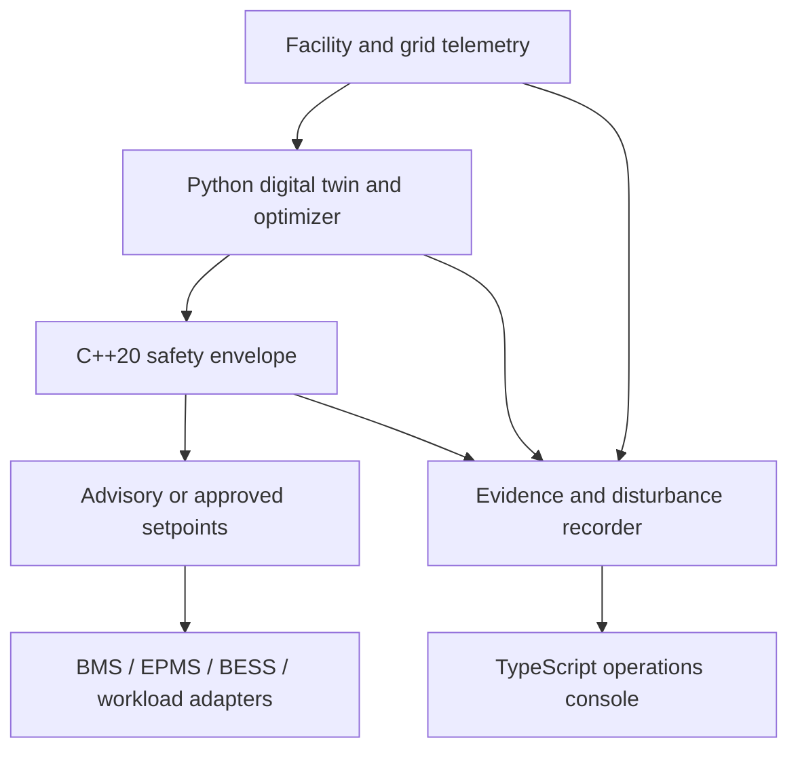

# CoolRide-PQ

**Open, grid-aware orchestration for data-center power, cooling, storage, and computational-load evidence.**

CoolRide-PQ is a vendor-neutral reference platform for studying and safely coordinating a data center's IT load, HVAC/liquid cooling, UPS/BESS, thermal storage, power converters, and point-of-common-coupling (PCC) behavior. The repository ships a working 50 MW IT reference scenario, a deterministic C++20 safety/controller core, Python sizing and simulation services, a TypeScript operator console, Bash automation, tests, and an evidence export.

> Status: engineering reference implementation. Advisory/digital-twin mode is the default. It is not a protection relay, UPS controller, certified BMS, or a substitute for interconnection studies, commissioning, or site authority approval.

## The problem

Data-center controls are usually divided by discipline: IT scheduling, mechanical cooling, UPS/BESS, DCIM/BMS/EPMS, and utility operations. Optimizing each subsystem independently can create a worse facility response at the PCC—for example, simultaneous recovery ramps after a voltage sag, storage recharge during a grid constraint, or cooling/VFD behavior that is missing from a planning model.

CoolRide-PQ treats the site as one constrained cyber-physical load. Its initial niche is not “another dashboard”; it is an auditable coordination and validation layer that can:

- size a target site and its flexibility envelope;
- keep IT, cooling/motor, converter, BESS, and auxiliary loads disaggregated;
- simulate normal, grid-alert, voltage-sag, harmonic, and sensor-failure modes;
- issue bounded supervisory recommendations through a deterministic safety envelope;
- record telemetry, decisions, constraints, and model versions for disturbance review;
- expose stable interfaces for future BACnet, Modbus, OPC UA, MQTT, OpenADR, IEC 61850, DCIM, and workload-scheduler adapters.

## Reference site

The included `reference-50mw-ai-campus.json` describes a 50 MW IT site at 115 kV with a 1.30 design PUE, 625 racks at 80 kW/rack, 70% liquid-cooling share, 10 MW / 30 MWh BESS, and 16 MWh thermal storage. The sizing engine calculates facility, cooling, UPS, generator, and ride-through requirements; the simulator then runs a deterministic 24-hour operating day with a grid alert and short PCC voltage disturbance.

The reference results are synthetic and are deliberately labeled as such. They are hypotheses for HIL/SIL and site-data validation, not guaranteed savings.

## Architecture



Control is separated into three time scales:

1. **Planning (minutes to hours):** forecast, sizing, scheduling, demand response, PUE and energy objectives.
2. **Supervisory (1–10 seconds):** mode selection, ramp limits, BESS P/Q allocation, thermal flexibility, IT deferral budget.
3. **Equipment protection (milliseconds):** remains in certified relays, UPS, drives, and OEM controllers. CoolRide-PQ does not bypass it.

## Quick start

Requirements: Python 3.11+, a C++20 compiler, and a modern browser. The zero-dependency demo uses only the Python standard library.

```bash
./scripts/test.sh
./scripts/build_cpp.sh
./scripts/run_demo.sh
```

Open `http://127.0.0.1:8080`. Useful endpoints:

- `GET /api/health`
- `GET /api/site/sizing`
- `GET /api/scenario`
- `POST /api/control/decision`
- `GET /api/evidence`

Generate the scenario and public graphics without starting the server:

```bash
./scripts/generate_demo.sh
```

## Repository map

```text
core/cpp/                    deterministic C++20 controller and CLI
src/coolride_pq/             Python domain, sizing, control, simulation, evidence, API
apps/ops-console/            TypeScript source and dependency-free browser build
configs/                     versioned target-site inputs
schemas/                     telemetry and decision JSON contracts
tests/                       Python unit/integration tests
docs/                        architecture, safety case, roadmap, LinkedIn launch pack
scripts/                     reproducible Bash workflows
generated/                   deterministic scenario outputs
```

## Safety and trust model

- Advisory-only unless a site-specific deployment explicitly enables actuation.
- Fail closed on stale/bad telemetry, violated temperature reserve, depleted SOC, or unavailable redundancy.
- Commands are bounded by ramp, temperature, SOC, P/Q capability, and operator-approved envelopes.
- Every decision includes reason codes, input quality, active constraints, controller version, and timestamp.
- No optimization result can override OEM protection, emergency power sequences, or utility instructions.
- Production deployment requires threat modeling, identity and authorization, signed configurations, network segmentation, secure update, HIL testing, commissioning, and independent safety review.

See [docs/SAFETY_CASE.md](docs/SAFETY_CASE.md) and [docs/ENTERPRISE_ARCHITECTURE.md](docs/ENTERPRISE_ARCHITECTURE.md).

## Standards and public context

This project is informed by, but not affiliated with:

- [NERC Project 2026-02 Computational Loads](https://www.nerc.com/standards/reliability-standards-under-development/2026-02-computational-loads)
- [NERC Large Loads Action Plan](https://www.nerc.com/initiatives/large-loads-action-plan)
- [NERC plan for emerging large-load reliability risks](https://www.nerc.com/globalassets/who-we-are/standing-committees/rstc/llwg/20260330_large-loads-industry-webinar.pdf)
- [Google's public data-center demand-response description](https://cloud.google.com/blog/products/infrastructure/using-demand-response-to-reduce-data-center-power-consumption)
- [Open Compute Project](https://www.opencompute.org/)
- [LF Energy](https://lfenergy.org/)

Draft computational-load criteria and requirements can change. This repository does not claim compliance with a draft or adopted reliability standard.

## Contributing

The highest-value contributions are real anonymized disturbance traces, validated equipment models, protocol adapters, HIL benchmarks, grid-study integrations, and safety/cybersecurity review. See [CONTRIBUTING.md](CONTRIBUTING.md).

## License

Apache License 2.0. See [LICENSE](LICENSE).
